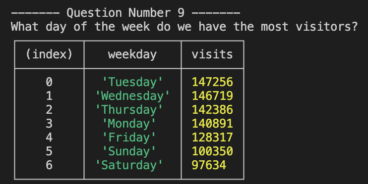

# 🔎 Query Google Analytics Data in Big Query

This is a NodeJS project that runs 10 queries against a public Google Analytics database 📊

The `goal` is to answer some business questions in order to optimize decision making 🎯

## Transactions 💰

### 1. What was the revenue for each product? 

```sql
SELECT
  p.V2ProductName as product_name,
  ROUND(SUM(p.productRevenue) / 1000000, 2) as product_revenue
FROM `bigquery-public-data.google_analytics_sample.ga_sessions_2017041*`,
  UNNEST(hits) AS h,
  UNNEST(h.product) AS p
  GROUP BY product_name
  ORDER BY product_revenue DESC
  LIMIT 10
```


### 2. What was the revenue for each month? 

```sql
SELECT
  FORMAT_DATE("%B", PARSE_DATE("%Y%m%d", date)) AS month,
  SUM(totals.totalTransactionRevenue) / 1000000 as total_revenue
  FROM
    `bigquery-public-data.google_analytics_sample.ga_sessions_*`
  GROUP BY month
  ORDER BY total_revenue DESC
  LIMIT 12
```


### 3. What was the revenue for each weekday?

```sql
SELECT
  FORMAT_DATE("%A", PARSE_DATE("%Y%m%d", date)) AS weekday,
  SUM(totals.totalTransactionRevenue) / 1000000 as total_revenue
  FROM
    `bigquery-public-data.google_analytics_sample.ga_sessions_*`
  GROUP BY weekday 
  ORDER BY total_revenue
  LIMIT 7
```


## Conversion Rate 🙌

### 1. What was the Conversion Rate by Channel? 

```sql
SELECT
  channelGrouping,
  ROUND( ( SUM(totals.transactions) / COUNT(*) ) * 100, 2) AS conversion_rate,
FROM
  `bigquery-public-data.google_analytics_sample.ga_sessions_*`
GROUP BY
  channelGrouping
ORDER BY
  conversion_rate DESC
```


### 2. What was the Conversion Rate by Device? 

```sql
SELECT
  device.deviceCategory as device,
  ROUND( ( SUM(totals.transactions) / COUNT(*) ) * 100, 2) as conversion_rate, 
  FROM
    `bigquery-public-data.google_analytics_sample.ga_sessions_*`
  GROUP BY device
  ORDER BY conversion_rate DESC
```


### 3. What was the Conversion Rate by Landing Page? 

```sql
SELECT
  page_path as landing_page,
  ROUND( ( SUM(total_transactions) / COUNT(*) ) * 100, 2) AS conversion_rate
FROM (
  SELECT
    totals.transactions AS total_transactions,
    isEntrance,
    page.pagePath AS page_path
  FROM
    `bigquery-public-data.google_analytics_sample.ga_sessions_2017043*`
  CROSS JOIN
    UNNEST(hits)
  WHERE
    isEntrance = TRUE )
GROUP BY
  landing_page
ORDER BY
  conversion_rate DESC
  LIMIT 10
```


## Bounce Rate 🏀

### 1. What was the Bounce Rate by Channel? 

```sql
SELECT
  channelGrouping,
  ROUND( ( SUM(totals.bounces) / COUNT(*) ) * 100, 2 ) AS bounce_rate
FROM
  `bigquery-public-data.google_analytics_sample.ga_sessions_*`
GROUP BY
  channelGrouping
ORDER BY
  bounce_rate DESC
```


### 2. What was the Bounce Rate by Device? 

```sql
SELECT
  device.deviceCategory AS device,
  ROUND( ( SUM(totals.bounces) / COUNT(*) ) * 100, 2 ) AS bounce_rate
FROM
  `bigquery-public-data.google_analytics_sample.ga_sessions_*`
GROUP BY
  device
ORDER BY
  bounce_rate DESC
```


## Peaks ⛰️

### 1. What day of the week do we have the most visitors?

```sql
SELECT
  FORMAT_DATE("%A", PARSE_DATE("%Y%m%d", date)) AS weekday,
  COUNT(*) as visits
  FROM
    `bigquery-public-data.google_analytics_sample.ga_sessions_*`
    CROSS JOIN UNNEST(hits)
  WHERE isEntrance = true
  GROUP BY weekday
  ORDER BY visits DESC
  LIMIT 7
```



### 2. What was the total visits per hour on black friday?

```sql
SELECT
  hour,
  COUNT(*) as visits
  FROM
    `bigquery-public-data.google_analytics_sample.ga_sessions_20161125`
    CROSS JOIN UNNEST(hits)
  WHERE isEntrance = true
  GROUP BY hour
  ORDER BY visits DESC
  LIMIT 24
```


PS: in order for it to work on your computer, you need to insert a valid service account credentials path and your Google Cloud Platform project id into the `.env` file. You can also authenticate using your own login by running `gcloud auth application-default login` (need to have the gcloud SDK installed on the machine and turn on the Big Query API on your Google Cloud Platform project).